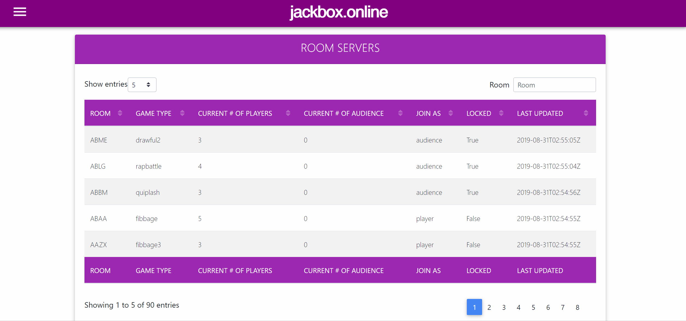

# Jackbox Online
*A Jackbox.TV Server List*

This is a service that provides an updated list of online Jackbox.TV rooms (similar to a server list for multiplayer games). You can filter the table to find various game types and join able games.

You can find a deployed version [here](http://jackbox.online/).

## Quick Run Guide
Run the following commands in command prompt or terminal.

To run the Frontend:
1. To start the node server:
    1. ``npm start``

To run the Backend (API) Section:
1. For a first time run, you will need to create the DB, do the following:
    1. ``python manage.py makemigrations``
    2. ``python manage.py migrate``
1. To run Django (API)
    1. ``python manage.py runserver``
## Built With:
* **Frontend / UI**: React
* **Backend**: Django (Python 3.x)
* **Database**: SQLite
* **Deployed on HEROKU**

## Installation
### For the Frontend Section:
1. Install [NPM](https://www.npmjs.com/get-npm)
2. Run the following command in the project folder: `` npm install ``

### For the Backend Section (API):
1. Install [Python 3](https://www.python.org/downloads/)
2. Go into the project folder, and run the following command: `` pip install -r requirements.txt``
    1. This will install the necessary python packages to run the project.

## Authors
**Jimmy Le** - [Jldevops](https://github.com/jldevops)

## License
Licensed under the [MIT License](LICENSE)